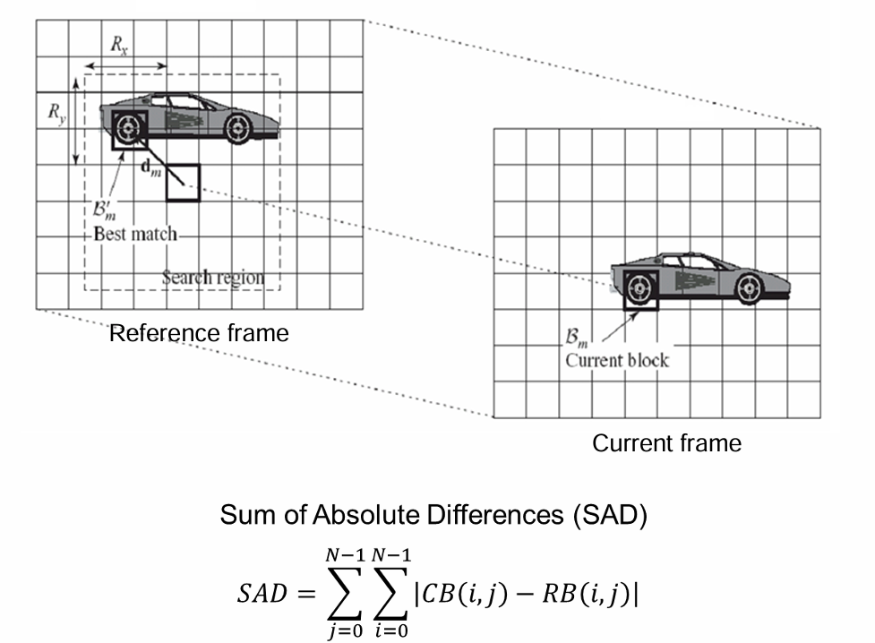
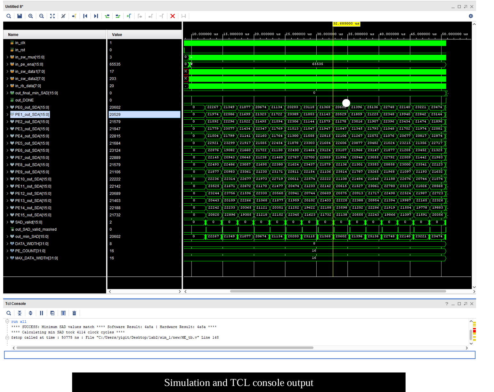
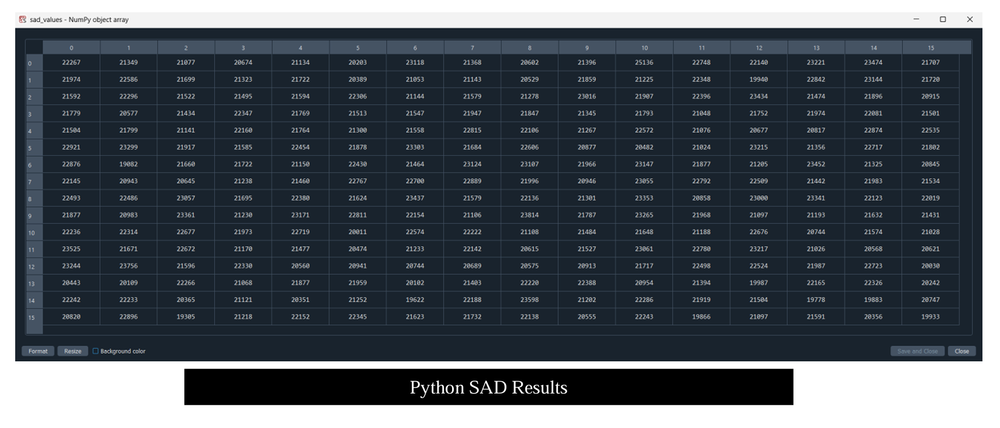
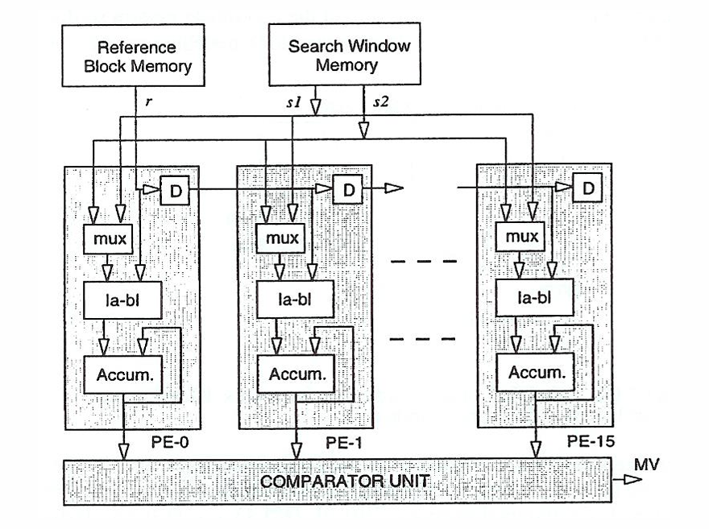
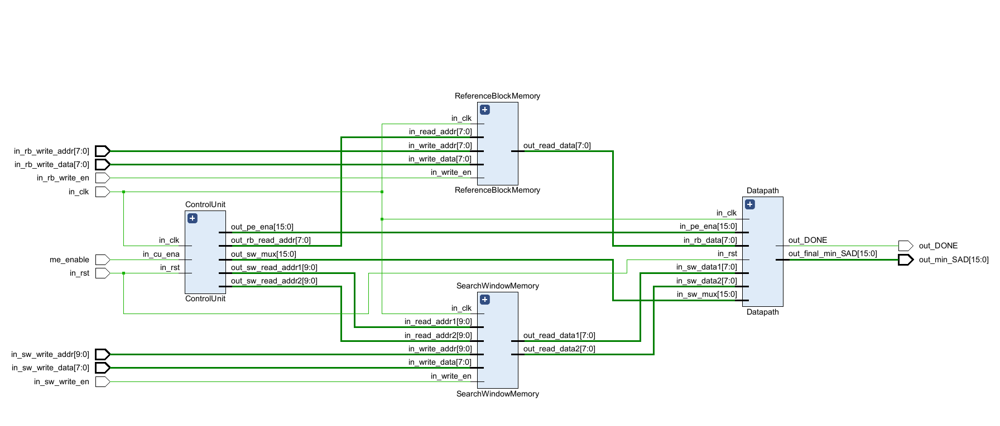
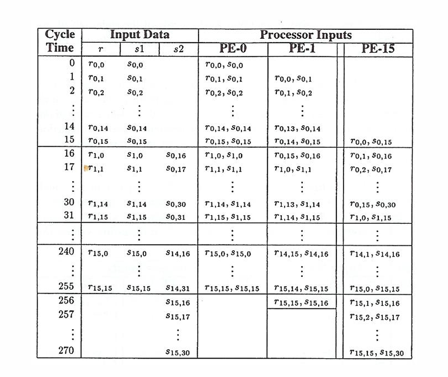

```markdown
# Motion Estimation Hardware

Hardware implementation of [Motion Estimation](https://en.wikipedia.org/wiki/Motion_estimation) algorithm written in Verilog-HDL.



## Table of Contents

1. [About Motion Estimation](#about-motion-estimation)
2. [Description](#description)
3. [Required Tools](#required-tools)
4. [How to Run Simulation](#how-to-run-simulation)
5. [How to Implement Motion Estimation Hardware](#how-to-implement-motion-estimation-hardware)
6. [Directory Structure](#directory-structure)
7. [Behavioral Simulation Result](#behavioral-simulation-result)
8. [Python Result](#python-result)
9. [Block Diagrams](#block-diagrams)
10. [Source Files](#source-files)

---

## About Motion Estimation

Motion Estimation is a process of finding motion vectors from a reference frame to the current frame. This process involves the following steps for each macro block in the current frame:
- Find a block with the lowest matching error in the search window of the reference frame.
- Use the sum of absolute difference (SAD) between corresponding pixels.
- The displacement between the current macro block and the best matching macro block is the motion vector.

---

## Description

- **Search Memory Window:** 31x31 pixels
- **Reference Memory Block:** 16x16 pixels
- **Parallel Processing:** 16 Processing Elements
- **Clock Frequency:** 32 MHz
- **Post-Implementation:** Nexys-A7-100T FPGA board

---

## Required Tools

- [Vivado ML Edition 2023.2](https://www.xilinx.com/support/download/index.html/content/xilinx/en/downloadNav/vivado-design-tools/2023-2.html)
- [Python 3.10](https://www.python.org/downloads/)

---

## How to Run Simulation

1. Go to the `/testbench/testcase/` directory and run the `/testbench/testcase/randblock_gen.py` script.
2. After running the script, execute `/testbench/testcase/min_SAD.py` to generate the `/testbench/testcase/min_SAD.txt` file.
3. Add the `/testbench/testcase/SearchWindowMemory_hw.txt`, `/testbench/testcase/ReferenceBlock_hw.txt`, and `/testbench/testcase/min_SAD.txt` files as simulation files in your VIVADO project.
4. Finally, run the `/testbench/ME_tb.v` file.

---

## How to Implement Motion Estimation Hardware

1. Go to the `/constraint` directory.
2. Add the constraint file to the relevant VIVADO project as a constraint file.
3. Add the source files from the `/rtl` directory and set `MotionEstimationTop.v` as the top module.
4. Run the implementation.

---

## Directory Structure

The Motion Estimation Processor source code is organized as follows:

```text
/docs       project report
/constraint constraint file
/rtl        RTL files for Motion Estimation Processor
/testbench  testbench source and testcase files
```

---

## Behavioral Simulation Result



---

## Python Result



---

## Block Diagrams

### Motion Estimation Block Diagram



### Motion Estimation RTL Block Diagram



### Processing Elements Scheduling



---

## Source Files

### Verilog Source Files

- **SearchWindowMemory.v:** Implements the memory that stores the search window data used in the motion estimation process.
- **ReferenceBlockMemory.v:** Stores the reference block data that is compared against the search window data during motion estimation.
- **ControlUnit.v:** Manages the control signals for coordinating the operations of different components in the motion estimation hardware.
- **Datapath.v:** Defines the data path for processing the input data, performing the necessary computations for motion estimation.
- **InstantMinComp.v:** Computes the minimum value instantaneously, used for determining the best match in motion estimation.
- **MinTrackerComp.v:** Tracks the minimum values over multiple comparisons to find the optimal motion vector.
- **MotionEstimationTop.v:** Top-level module that integrates all submodules and coordinates the overall motion estimation process.
- **ProcessingElements.v:** Contains the array of processing elements that perform the core computations for motion estimation, such as calculating the Sum of Absolute Differences (SAD).

### Verilog Testbench Files

- **randblock_gen.py:** Generates random blocks for use in motion estimation testing.
- **min_SAD.py:** Computes the minimum Sum of Absolute Differences (SAD) in software for comparison with hardware results.
- **ME_tb.v:** Testbench for the Motion Estimation hardware. It initializes signals, loads data from text files into memories, and compares hardware and software results.
- **SearchWindowMemory_hw.txt:** Contains binary data for initializing the search window memory in the testbench.
- **ReferenceBlock_hw.txt:** Contains binary data for initializing the reference block memory in the testbench.
- **SearchWindowMemory_sw.txt:** Contains decimal data for initializing the search window memory in the software.
- **ReferenceBlock_sw.txt:** Contains decimal data for initializing the reference block memory in the software.
- **min_SAD.txt:** Contains the expected minimum SAD value calculated by the software for comparison with the hardware result.
```